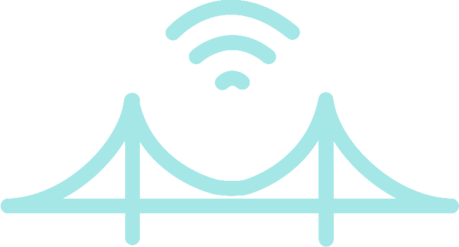
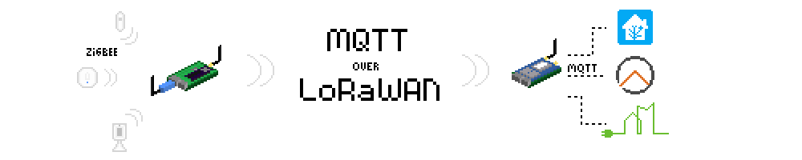

!!! warning "Deprecation Notice"
    ##### Please visit the [**new Documentation**](https://lorabridge2.github.io/) for detailed information about changes, setup and usage instructions.
    
    LoRaBridge (v1.0) is **deprecated** and superseded by [**LoRaBridge2**](https://github.com/lorabridge2).
      
    [**LoRaBridge2**](https://github.com/lorabridge2) features for instance **home automation** support, better **data reduction** as well as a **revamped code base**, but requires a different [LoRaWAN module](https://lorabridge2.github.io/system_overview/hw_components.html).
    
# LoRaBridge Documentation

LoRaBridge provides range extension to ZigBee sensors via LoRaWAN. This way, users can deploy sensors to locations which
are usually hard to reach with a short/medium range wireless connection, e.g. cellars/attics/garden houses. 

Here you can find information on setting up your first
bridge and gateway units, connecting sensors and visualizing sensor data. Details on system architecture and software components for customization/further development are provided as well.

# Table of Contents
1. [Installation](setup/Installation.md)
2. [How-to use](setup/How-to-use.md)
3. [Hardware overview](system_overview/hw_components.md)
4. [Software overview](system_overview/sw_components.md)
5. [Troubleshooting](setup/Troubleshooting.md)
6. [For developers](development/dev.md)