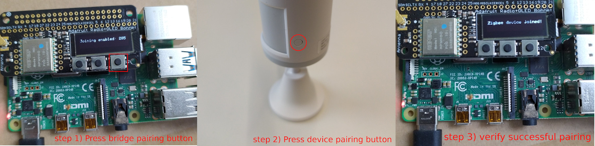
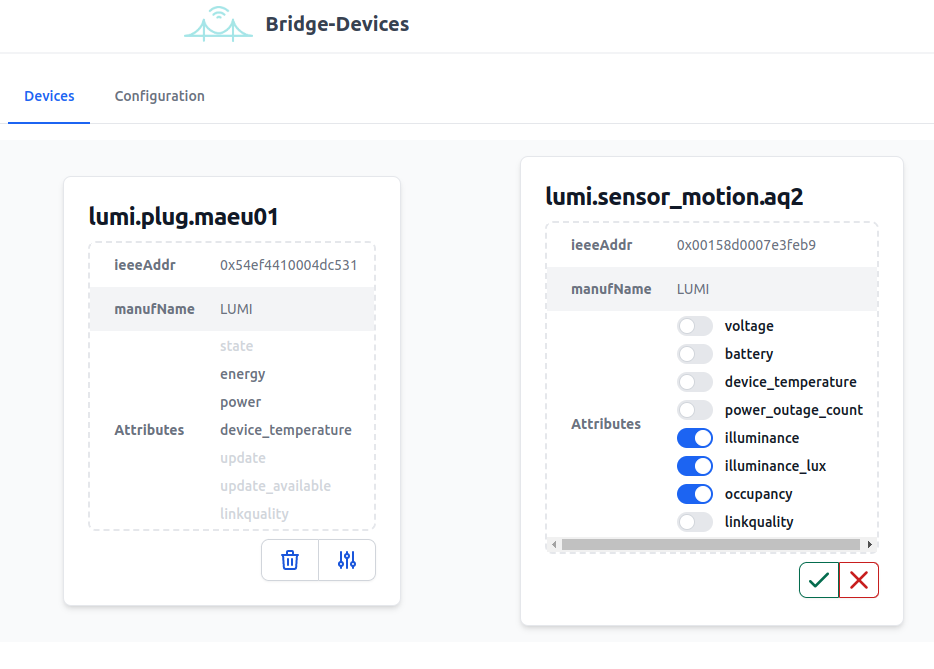
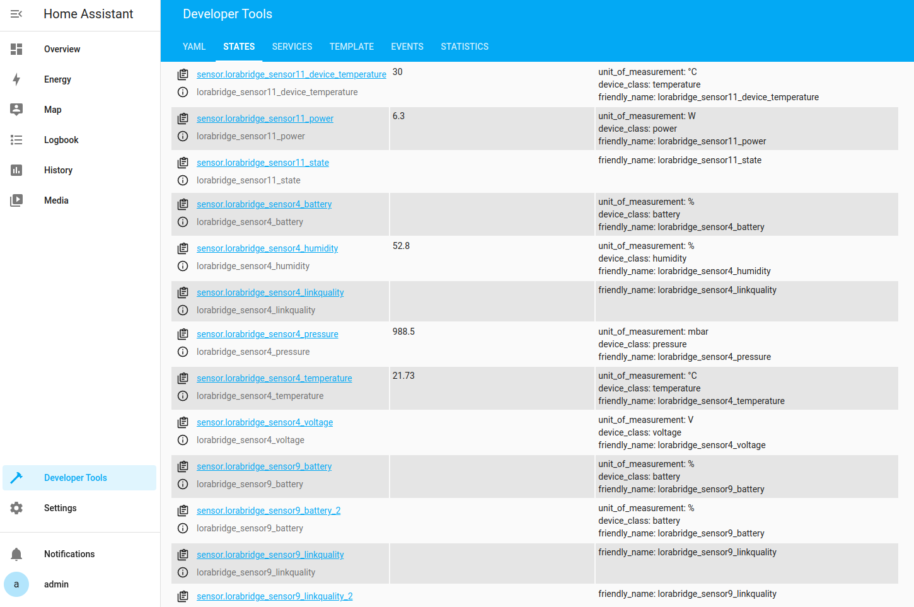
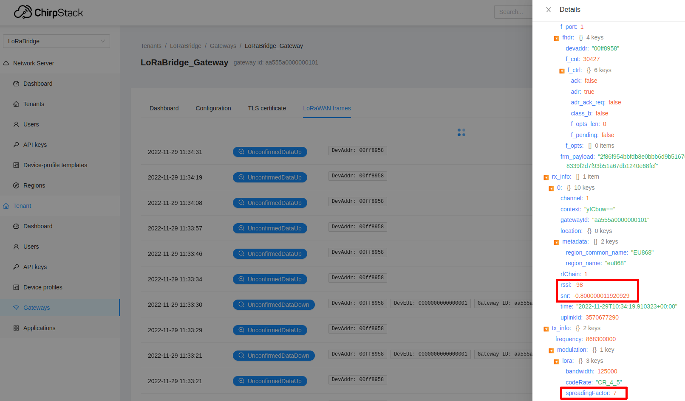

# How-to use

This page contains the basic information on how to use LoRaBridge bridge and gateway units.

# Pair a sensor device

Before proceeding with Zigbee device pairing, the Bridge unit needs to be set into pairing mode. To do so,
as the first step toggle the 3rd push button on the Raspberry PI LoRa modem as displayed in the figure above. This enables pairing
mode for the Zigbee coordinator for 5 minutes during which the bridge unit accepts pairing of new devices. Now, a new
device can be paired, which is typically established with a pairing button (see zigbee2mqtt device documentations/device manufacturer manuals for details).
Successful pairing event is displayed on the LCD display of the Bridge unit. 

# Set sensor/meta data filters

Since the LoRaWAN connection is originally meant to deliver small amounts of data, in some use-cases it is reasonable to limit
the amount of data transmitted from the bridge unit to the gateway unit. The bridge unit www interface, as illustrated in the figure above,
allows for disabling/enabling routing of data/meta data. For instance, if a user is only interested in monitoring the illuminance and
the occupancy status of a motion sensor, the irrelevant measurements such as voltage/battery level can be left disabled. The
easiest way to access the bridge www interface is to navigate to (IP address of bridge unit):3000.

# Inspect sensor data in Home Assistant

The full installation of LoRaBridge is equipped with the popular Home Assistant back-end for which LoRaBridge gateway provides an integration. The home assistant
can be accessed with a browser under (gateway IP address):8123. After a successful device pairing, the zigbee sensor measurements appear automatically in the home assistant as lorabridge_sensorX_(measurement type) entities as illustrated in the Figure above. As an example, for a Xiaomi temperature/humidity sensor six entities (temperature,humidity,pressure,voltage,battery and link-quality) are added. The list of entities can be found under "Developer tools" -> "States".

# Inspect LoRaWAN link behaviour in Chirpstack

After deployment a user might be interested to verify the quality of the LoRaWAN link. This can be done in the www UI of the Chirpstack LoRaWAN gateway accessible
under (gateway IP address):8080. The live LoRaWAN frames captured by the gateway unit can be found under "Gateway" -> "gateway id" -> "LoRaWAN Frames" (see the figure below). As the bridge
unit transmits next to sensor data also "heart beat" packets, a user shall expect to see LoRaWAN frames within regular intervals (at minimum a packet every few minutes). 
Expansion of the "Unconfirmed Data-up" message reveals some interesting meta-data such as received signal strength (RSSI), signal to noise ratio (SNR) and spreading factor.
In principle, a low spreading factor (e.g. 7-8) and a high RSSI (-80 dB to -90 dB) indicates a high link quality. On the other hand, a high spreading factor (i.e. 12) and a low
RSSI (-120 dB)/SNR (< -10 dB) are indicators for a low link quality for which might cause loss of data. In such case, take a look at [Troubleshooting section](Troubleshooting.md).

