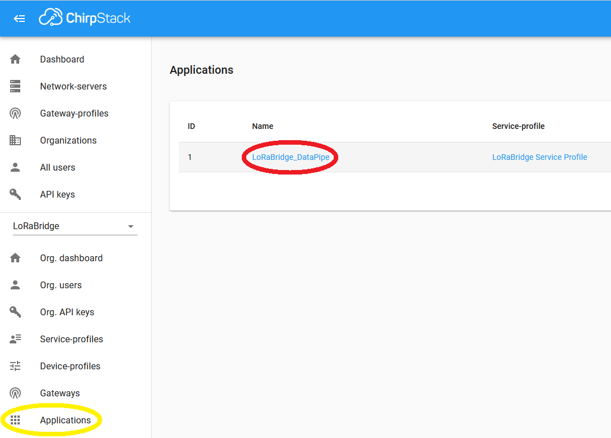
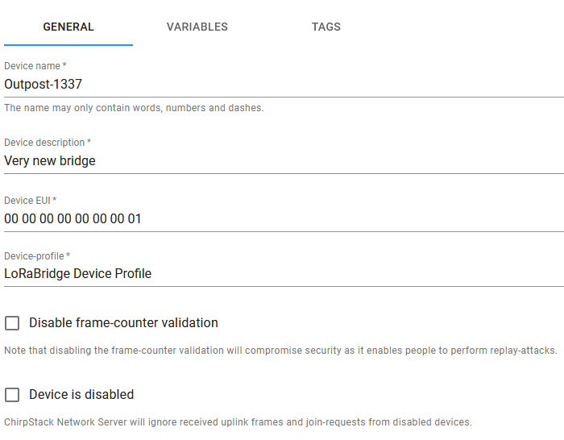
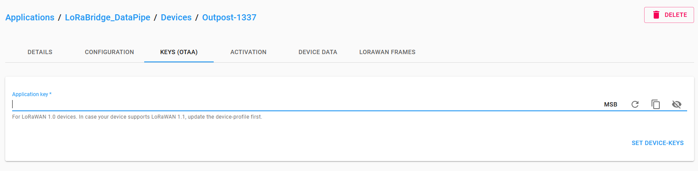

# Installation

This page guides you through the installation of a Lorabridge bridge and gateway device.
First, you need to ensure your Raspberry devices fulfill the [Requirements](#requirements).
Then you can either use the mostly automated [Ansible setup](#ansible-setup) or perform the steps [manually](#manual-setup).

## Requirements

### Hardware

You can find the necessary hardware [here](../system_overview/hw_components.md)

### Software

You need to:

- install [Raspberry Pi OS](https://www.raspberrypi.com/software/) (Lite is fine)
  - make sure to enable ssh and ensure the raspi is connected to the Internet
- [Install docker and docker compose](https://docs.docker.com/engine/install/ubuntu/) [manual setup]
- install `git` (via `sudo apt-get install git`) [manual setup]
- enable spi (via `sudo raspi-config nonint do_spi 0`) [manual setup]

## Ansible Setup

This setup method automates several steps of the installation process of bridge and gateways devices. You need to clone the [lorabridge-setup](https://github.com/lorabridge/lorabridge-setup) github repository.
The repository provides an ansible project for setting up LoRaBridge devices via ssh.

You need to prepare the Raspberry Pi devices as described in [Requirements](#requirements).

### Clone Setup Repository

Download the code for the Ansible setup and switch inside the folder:

```bash
git clone https://github.com/lorabridge/lorabridge-setup.git
cd lorabridge-setup
```

### Ansible Controller Requirements

You need to install the requirements listed in following files inside the repository on the host running the setup:

- `apt-requirements.txt`
- `Pipfile`
- `requirements.yml`

!!! tip "Installing Requirements"
    Install requirements with e.g.

    ```bash
    xargs apt install -y < apt-requirements.txt
    # apt-get install $(cat apt-requirements.txt | tr '\n' ' ')
    pipenv install
    ansible-galaxy install -r requirements.yml
    ```

### Inventory file

Copy the `inventory.sample` file, name it `inventory` and Replace the placeholders with the actual values of the bridge and gateway devices.

```ini
[bridges]
<bridges ip address> hostname=<desired hostname>

[gateways]
<gateway ip address> hostname=<desired hostname>
```

### Configuration Variables

Configuration variables are defined in following places:

```bash
group_vars/all/all.yaml
group_vars/bridges/*
group_ars/gateways/*
roles/<role name>/defaults/main.yaml
```

You can overwrite them by creating a new `yaml` file (e.g. `myconfig.yaml`) inside `group_vars/all/`, `group_vars/bridges/` or `group_vars/gateway/` and configuring the desired value in there.
Doing this inside `group_vars/all/` affects all devices, `group_vars/bridges/` affects only bridge devices and `group_vars/gateways/` affects only gateway devices.

Usually you will not need to change the configuration unless you changed the default user name.
!!! example "Example for changing the user name to user1"
    - Create a custom configuration file `group_vars/all/custom.yaml`
    - Insert the following content:
    ```bash
    ---
    pi_user: "user1"
    ```

### Executing the setup

Start the setup with the following command:

```bash
ansible-playbook -i inventory lorabridge.yaml --ask-become-pass --ask-pass
```

## Manual Setup

### Preparation of bridge unit

#### Step 1 - Cloning

Clone our top-level repository [`lorabridge/lorabridge`](https://github.com/lorabridge/lorabridge) either via ssh per  
`git clone --recursive git@github.com:lorabridge/lorabridge.git`  
or via https per  
`git clone --recursive https://github.com/lorabridge/lorabridge.git`

!!! info
    You can also use the new github cli tool `gh repo clone lorabridge/lorabridge -- --recursive` (prior config necessary - see [manual](https://cli.github.com/))

#### Step 2 - Navigation

Navigate into the repository with `cd lorabridge`.  
If you are setting up a bridge do `cd bridge`.

#### Step 3 - Configuration

Copy `env.example` to `.env` and modify variables in `.env` as necessary, see [config](config.md#Environment-variables) for further details.

Following variables need to be changed for a __bridge__ device:

- `LORA_DEV_EUI`
- `LORA_DEV_KEY`
- `BASIC_AUTH`

!!! info
    variables are automatically substituted in `docker-compose.yml` file

#### Step 4 - Container creation

##### Pre-built images

All images are pre-built via github actions on every commit and every sunday. Use those image with:

```bash
docker compose pull
docker compose up -d
```

??? tip "Self-built images"
    You can build your own images for development purposes via:

    ```bash
    docker compose -f docker-compose.dev.yml build --pull
    docker compose -f docker-compose.dev.yml up -d
    ```

### Preparation of gateway unit

#### Step 1 - Cloning

Clone our top-level repository [`lorabridge/lorabridge`](https://github.com/lorabridge/lorabridge) either via ssh per  
`git clone --recursive git@github.com:lorabridge/lorabridge.git`  
or via https per  
`git clone --recursive https://github.com/lorabridge/lorabridge.git`

!!! info
    You can also use the new github cli tool `gh repo clone lorabridge/lorabridge -- --recursive` (prior config necessary - see [manual](https://cli.github.com/))

#### Step 2 - Navigation

Navigate into the repository with `cd lorabridge`.  
If you are setting up a bridge do `cd gateway`.

#### Step 3 - Configuration

Copy `env.example` to `.env` and modify variables in `.env` as necessary, see [config](config.md#Environment-variables) for further details.

Following variables need to be changed, when setting up a __gateway__:

- `CHIRPSTACK_DEV_EUI`
- `CHIRPSTACK_DEV_KEY`
- `CHIRPSTACK_API_SECRET`

!!! info
    variables are automatically substituted in `docker-compose.yml` file

#### Step 4 - Container creation

##### Pre-built images

All images are pre-built via github actions on every commit and every sunday. Use those image with:

```bash
docker compose pull
docker compose up -d
```

??? tip "Self-built images"

    You can build your own images for development purposes via:

    ```bash
    docker compose -f docker-compose.dev.yml build --pull
    docker compose -f docker-compose.dev.yml up -d
    ```

### Adding another bridge device to the gateway

#### Device setup

Follow the instructions for [setting up a bridge](#preparation-of-bridge-unit) for the additional bridge.

When copying `env.example` to `.env` and modifying the default values, choose a __unique identifier__ for `LORA_DEV_EUI` (has to be unique for __every__ bridge).

!!! info 
    `LORA_DEV_KEY` needs to be the same as on the gateway.

#### Add device to gateway

Open the ChirpStack webinterface inside the browser via `http://<ip-or-hostname>:8080`.

Go to `Applications` and press on the name of the application `LoRaBridge_DataPipe`.



On the next page (Devices) press on `Create`.

Fill in the device name and description, enter the new bridges' `LORA_DEV_EUI` in the Device EUI field and choose the `LoRaBridge Device Profile` as Device-profile. Then press on `Create Device`.



The webinterface redirects you to the page of your new device, the current tab should now be `KEYS (OTAA)`. Enter the `LORA_DEV_KEY` value of your `.env` file in the Application key field and press `SET DEVICE-KEYS`.



Your device should now be up and running. It might take a while until device has connected to the gateway and sends packets.

## Verify system functionality

Pair a sensor with the bridge unit following the instructions [here](How-to-use.md#pair-a-sensor-device).  
After the sensor transmits data (either after waiting or manually triggering it), the data should show up in the Home Assistant interface as shown [here](How-to-use.md#inspect-sensor-data-in-home-assistant).