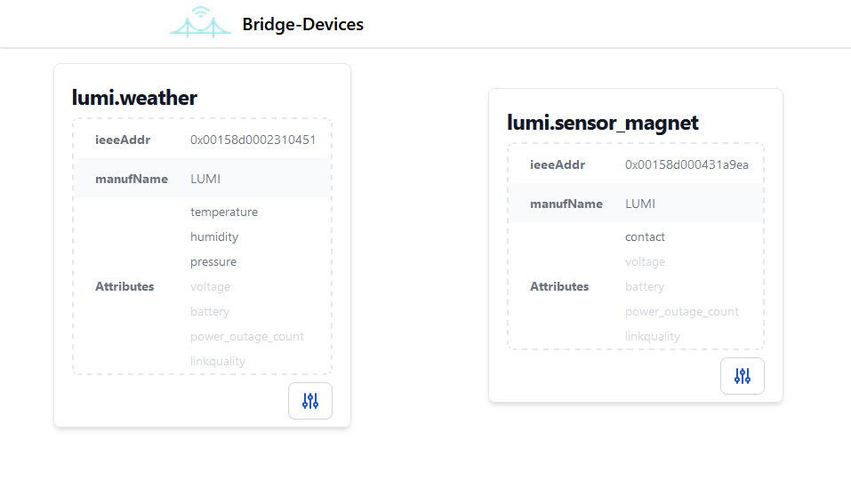
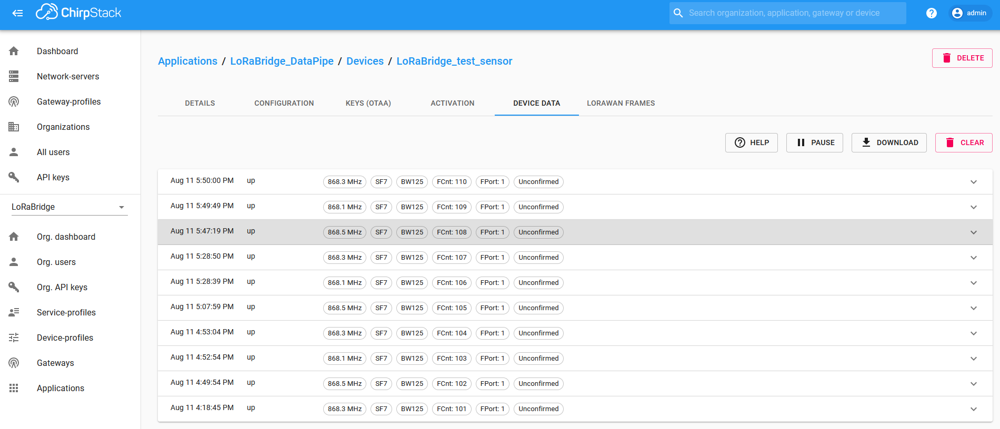
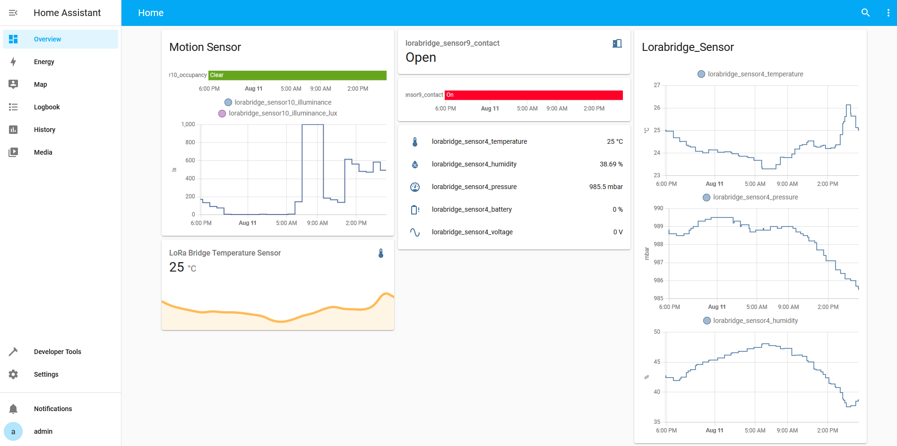

# Software Components

We utilise [Docker](https://docs.docker.com/get-started/overview/) and [Docker Compose](https://docs.docker.com/compose/) to provide all necessary LoRaBridge software components as a multi-container Docker application. The components needed for bridges and gateways vary and are listed below.

## Bridge

> [Butix](https://commons.wikimedia.org/wiki/User:Butix), based on works by [Lucasbosch](https://commons.wikimedia.org/wiki/User:Lucasbosch) and [Cmykey](https://commons.wikimedia.org/wiki/User:Cmykey), [Raspberry Pi 3 illustration](https://commons.wikimedia.org/wiki/File:Raspberry_Pi_3_illustration.svg), modified, [CC BY-SA 4.0](https://creativecommons.org/licenses/by-sa/4.0/legalcode)

As shown [here](hw_components.md#bridge), a bridge needs a ZigBee dongle for connecting ZigBee devices, a LoRaWAN hat for establishing a link to the gateway as well as optionally a network connection.

### Zigbee2MQTT

[Zigbee2MQTT](https://www.zigbee2mqtt.io/) receives device data from the ZigBee dongle as it handles join events, status updates and so on. It keeps a list of devices and publishes the device data via MQTT messages to [Eclipse Mosquitto](#eclipse-mosquitto).

### Eclipse Mosquitto

[Mosquitto](https://mosquitto.org/) is an MQTT message broker, meaning you can publish your own messages as well as subscribe to messages sent by others. In case of the bridge, [Zigbee2MQTT](#zigbee2mqtt) publishes the sensor data to the Mosquitto server, while the [Forwarder](#forwarder) is subscribed to those.

### Forwarder

The [Forwarder](https://github.com/lorabridge/bridge-forwarder) is a self-provided Python3 program and listens to message on the [Mosquitto](#eclipse-mosquitto) server. It removes disabled attributes (a list that can be modified via the [web interface](#web-interface)) and performes a combination of key substitution, [YAML](https://yaml.org/) reformatting and [Brotli](https://github.com/google/brotli) compression. The resulting compressed data is pushed to a list in a [Redis](#redis) server.

### Redis

[Redis](https://redis.io/) is an in-memory data store and is used as a cache / message queue in our case. It receives compressed sensor data from the [Forwarder](#forwarder) and holds the data until [LoRaWAN TX](#lorawan-tx) retrieves it.

### LoRaWAN TX

[LoRaWAN TX](https://github.com/lorabridge/bridge-lorawan_tx) is a self-provided C program, which is based on the [IBM LMIC](https://github.com/mcci-catena/ibm-lmic) code. It establishes a LoRaWAN connection to the gateway, pulls compressed device data from the [Redis](#redis) server and transmits the data to the gateway.

### Web Interface

Our [web interface](https://github.com/lorabridge/bridge-device-interface) is a self-provided [SvelteKit](https://kit.svelte.dev/) web application that shows the ZigBee devices, which are retrieved via the [SSE server](#sse-server). It enables you to disable unnecessary sensor attributes, in order to further reduce the transmitted data. Authentication is provided with [basic auth](#basic-auth) via nginx.

!!! info
    The default port via [Basic Auth](#basic-auth)  is `3000`

??? example
    

### SSE Server

The [SSE server](https://github.com/lorabridge/bridge-device-sse) is a self-provided TypeScript application. It retrieves a list of ZigBee devices from the [Zigbee2MQTT](#zigbee2mqtt) server and provides the data per HTTP as well as any updates to the data (e.g. new devices, additional attributes) per [server-sent events (SSE)](https://html.spec.whatwg.org/multipage/server-sent-events.html#server-sent-events) for the [web interface](#web-interface).

### Basic Auth

This component consists of a nginx and provides authentication for the [web interface](#web-interface) via Basic HTTP Authentication.

### LCD UI

The [LCD UI](https://github.com/lorabridge/bridge-lcd-ui) controls the LCD display on the LoRaWAN hat and display various information like how many devices are joined, the state of the LoRaWAN connection and the current ip address. It also provides the ability to allow zigbee devices to join, by pressing the right button below the display. Informations is retrieved via [Redis](#redis), [Mosquitto](#eclipse-mosquitto) and [Ofelia](#ofelia).

### Ofelia

[Ofelia](https://github.com/mcuadros/ofelia) is a job scheduler design for docker environments. This container is only connected to the host network and we use Ofelia to periodically retrieve the current IP addresses and store them inside a file. This file is mounted into the [LCD UI](#lcd-ui) container and provides thie IP information. This setup is necessary, because docker does not allow a container to belong to multiple networks at once (per `docker-compose.yml`).

## Gateway

> [Butix](https://commons.wikimedia.org/wiki/User:Butix), based on works by [Lucasbosch](https://commons.wikimedia.org/wiki/User:Lucasbosch) and [Cmykey](https://commons.wikimedia.org/wiki/User:Cmykey), [Raspberry Pi 3 illustration](https://commons.wikimedia.org/wiki/File:Raspberry_Pi_3_illustration.svg), modified, [CC BY-SA 4.0](https://creativecommons.org/licenses/by-sa/4.0/legalcode)
>
!!! note
    The black arrows in the gateway diagram above show the direct communation paths. The grey arrows symbolize the logical communication flow, while the blue arrows represent data persistence.

As shown [here](hw_components.md#gateway), a gateway needs a LoRaWAN hat for establishing links to the bridges as well as optionally a network connection.

### Packet Forwarder

The [Packet Forwarder](https://github.com/lorabridge/gateway-forwarder) is a self-provided C application based on [this repository](https://github.com/fhessel/dragino_pi_gateway_fwd) that interacts with the LoRaWAN hat. It receives the LoRaWAN packets and publishes the data to the [ChirpStack Gateway Bridge](#chirpstack-gateway-bridge) on port `1700/udp`.

### Eclipse Mosquitto (Gateway)

[Mosquitto](https://mosquitto.org/) is an MQTT message broker, meaning you can publish your own messages as well as subscribe to messages sent by others. In case of the gateway, the [ChirpStack Gateway Bridge](#chirpstack-gateway-bridge) publishes the forwarded LoRaWAN data to the Mosquitto server. Various other services read/write data from to the Mosquitto server, while modifying the data. The next service in line in the logical processing chain is [ChirpStack](#chirpstack).

### ChirpStack Gateway Bridge

The [ChirpStack Gateway Bridge](https://www.chirpstack.io/docs/chirpstack-gateway-bridge/index.html) converts LoRa Packet Forwarder protocols in a common data format. It receives the data from the [Packet Forwarder](#packet-forwarder), converts it and publishes it to the [Mosquitto](#eclipse-mosquitto-gateway) for the [ChirpStack](#chirpstack).

### ChirpStack

[ChirpStack](https://www.chirpstack.io/docs/chirpstack/changelog.html) handles parts of the LoRaWAN communication like the authentication as well as provides a device inventory as well as a web interface for displaying LoRaWAN connections, data and for configuration. It persists data in a [PostgreSQL](#postgresql) database and uses [Redis](#redis-gateway) as a session store and for non-persistent data. It receives and publishes data via [Mosquitto](#eclipse-mosquitto-gateway).

!!! info
    The default port is `8080`

??? example
    

### PostgreSQL

[PostgreSQL](https://www.postgresql.org/) is an object-relational database and by the [ChirpStack](#chirpstack) for storing persistent data.

### Redis (Gateway)

[Redis](https://redis.io/) is an in-memory data store and is used for storing session and non-persistent data by the [ChirpStack](#chirpstack).

### Converter

The [Converter](https://github.com/lorabridge/gateway-converter) is a self-provided Python3 application, which listens for the device data published by the [ChirpStack Gateway Bridge](#chirpstack-gateway-bridge) via MQTT message on the [Mosquitto](#eclipse-mosquitto-gateway). It decompresses the data, undoes the key substitution and reformats the data. Afterwards, the data is published back to the [Mosquitto](#eclipse-mosquitto-gateway) server.

### Device Manager

The [Device Manager](https://github.com/lorabridge/gateway-device_manager) is a self-provided Python3 application keeping track of the seen devices via the [Redis](#redis-gateway) server. It publishes MQTT messages on the [Mosquitto](#eclipse-mosquitto-gateway) server for device discovery events and status (data) updates. These messages are picked up by the [HA Integration](#ha-integration) service.

### HA Integration

The [HA Integration](https://github.com/lorabridge/gateway-ha_integration) is a self-provided Python3 application. It translates the MQTT messages sent by the [Device Manager](#device-manager) into messages understood by the MQTT integration of the [Home Assistant](#home-assistant).

!!! tip
    This additional translation step enables easy integration of other services (e.g. a replacement for [Home Assistant](#home-assistant) or an extra web interface).

### Home Assistant

Our [Home Assitant](https://github.com/lorabridge/gateway-home-assistant) is a preconfigured version of the [official Home Assistant](https://www.home-assistant.io/), a home automation web interface, and is used to diplay the devices and sensor data. It subscribes to MQTT messages via [Mosquitto](#eclipse-mosquitto-gateway).

!!! info
    The default port is `8123`

??? example
    
